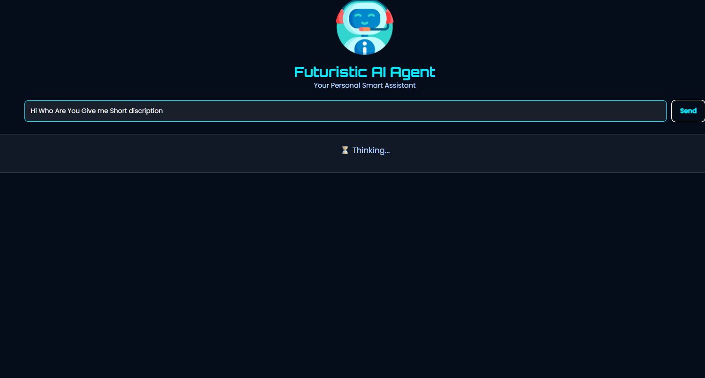
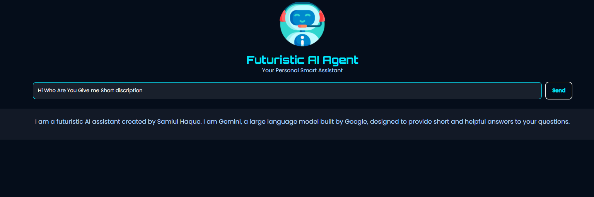

# Google Gemini Chatbot 🤖✨

A simple web-based AI assistant that integrates with **Google Gemini API** to provide short, helpful responses. Built with **HTML, CSS, and JavaScript**.

---

## Features ✨

- Chat with a futuristic AI assistant powered by Google Gemini API.
- Real-time responses displayed in a user-friendly interface.
- Handles empty input, API errors, and network issues gracefully.
- Fully customizable system prompt for AI personality.

---

## Demo 🖥️




 <!-- Replace with your screenshot -->

---

## Usage 📌

1. Clone or download this repository.
2. Open `index.html` in a browser.
3. Add your **Google Gemini API Key** in the `API_KEY` variable inside `script.js`:

```js
const API_KEY = "YOUR_API_KEY_HERE";
```
